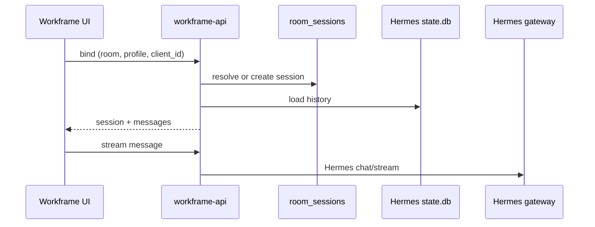

# Sessions and chat

How Workframe binds browser chat to Hermes sessions.

## Data stores

| Store | Holds |
|-------|--------|
| `workframe.db` → `room_sessions` | Active Hermes session per room + agent |
| Hermes `state.db` | Message history per profile/session |
| `Agents/profiles/u-{user}-{template}/` | Per-user runtime (SOUL, skills, credentials) |
| `lane-registry.json` | UI tab hint cache (derived; room binding wins when `room_id` is set) |

## Agent DM flow

## Per-user runtime profiles

Template agents (e.g. `{slug}-agent`) clone to `u-{user}-{slug}-agent` so each member's keys and chat history stay isolated. Credentials are vault-managed; the gateway uses short-lived lease tokens rather than raw secrets on shared mounts.

## Binding keys

| Context | Meaning |
|---------|---------|
| Browser agent DM | `source_id=ui`, `client_id=ui-{tab}` — one session per tab |
| Space @mention | `source_id=room`, `client_id=room_id` — shared room session for that agent |

## User actions

| Action | Behavior |
|--------|----------|
| Open agent DM | Bind or resume session for that room + profile |
| Send message | Stream to bound Hermes session |
| New session | Archive prior binding, create fresh session |
| Space @mention | Server invokes agent; live SSE to all room members |
| Stop / steer | Halt or redirect the active run |
