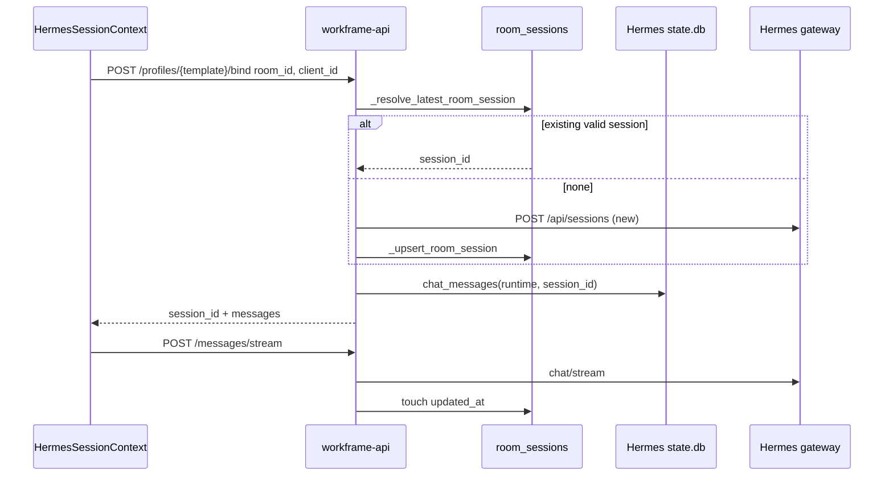

# Session architecture

Canonical reference for room binding, agent DMs, and lane registry behavior.  
Sources: `services/workframe-api/server.py`, `apps/web/src/contexts/HermesSessionContext.tsx`.

## Sources of truth

| Layer | Store | Owns |
|-------|--------|------|
| **Room binding** | `workframe.db` → `room_sessions` | Hermes `session_id` for `(room_id, agent_profile_id)` |
| **Message content** | Hermes `state.db` per profile | User/assistant/tool rows |
| **Runtime profile** | `Agents/profiles/u-{user}-{template}/` | SOUL, skills, config, credential overlay |
| **Lane registry** | `lane-registry.json` | Derived cache for `(profile, source_id:client_id)` |

**Rule:** When `room_id` is present, `room_sessions` wins. Lane registry is mirrored after bind/stream — never authoritative over `room_sessions`.

## Agent DM flow



## Runtime profile identity

Template profiles (e.g. `{slug}-agent`) clone to per-user runtime homes:

```text
Agents/profiles/workframe-agent/     template SOUL + skills
Agents/profiles/u-{user}-workframe-agent/   runtime copy + vault overlay
```

Bootstrap paths:

- **create-workframe** — full seed at install from `packages/create-workframe/profiles/`
- **BFF** — `ensure_runtime_profile()` backfills missing identity on touch

Credential vault strips raw keys from runtime `.env`; per-turn leases proxy LLM calls.

## UI operations map

| User action | API | Session resolver |
|-------------|-----|------------------|
| Open agent DM | `POST .../bind` | `room_sessions` |
| Send message | `POST .../messages/stream` | `stateDbSidRef` from bind |
| New session | `POST .../bind` + `new_session: true` | archives prior, creates new |
| Space @mention | server dispatch | `room_sessions` + template profile |
| Steer / stop | `POST /api/chat/steer` \| `stop` | active run on runtime profile |

## Binding dimensions

| Context | `source_id` | `client_id` | `binding_version` |
|---------|-------------|-------------|-------------------|
| Browser agent DM | `ui` | `ui-{tab}` (localStorage) | `2` for native template |
| Space agent turn | `room` | `room_id` | omitted |

## Deprecated paths (do not extend)

- `GET /api/chat/resolve` — lane-registry read without `room_id`
- UI calling `POST .../sessions` as a second resolver
- `dispatchLaneTurn` after stream (stream `finally` already syncs)
- Install `profile_chat_session` without `room_id`
