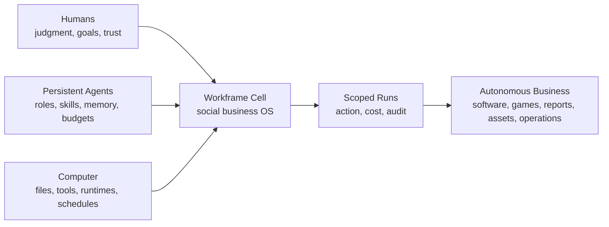
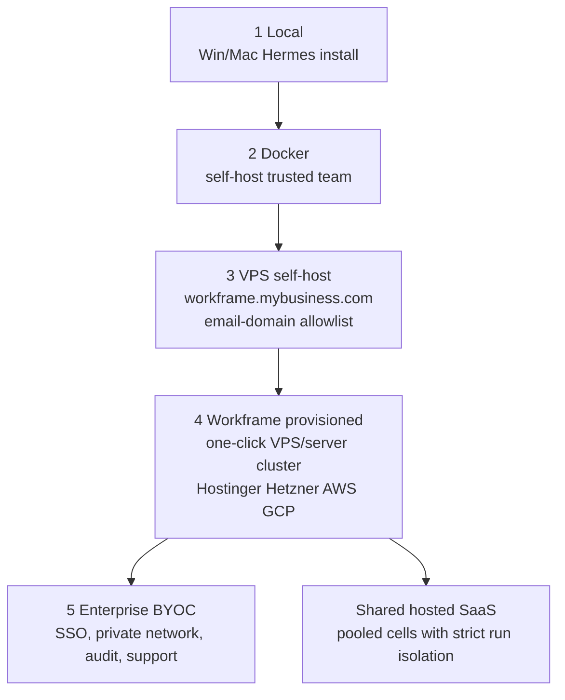
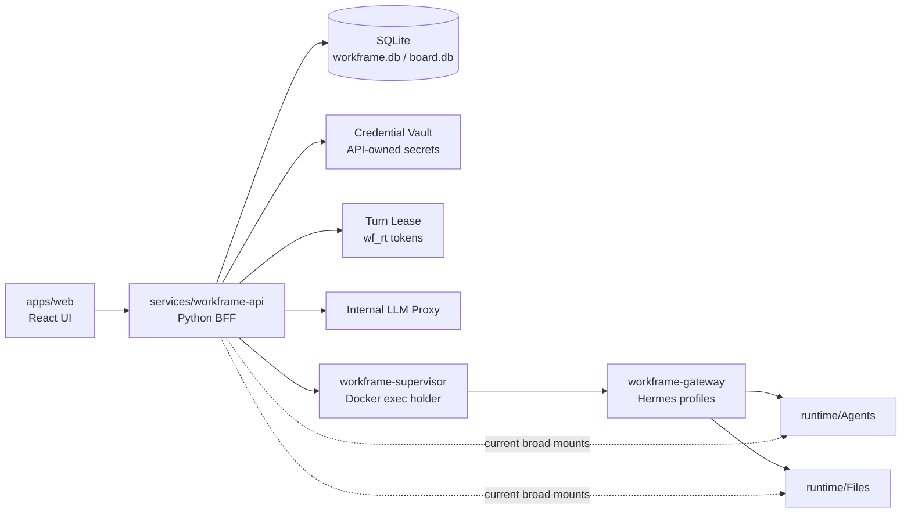
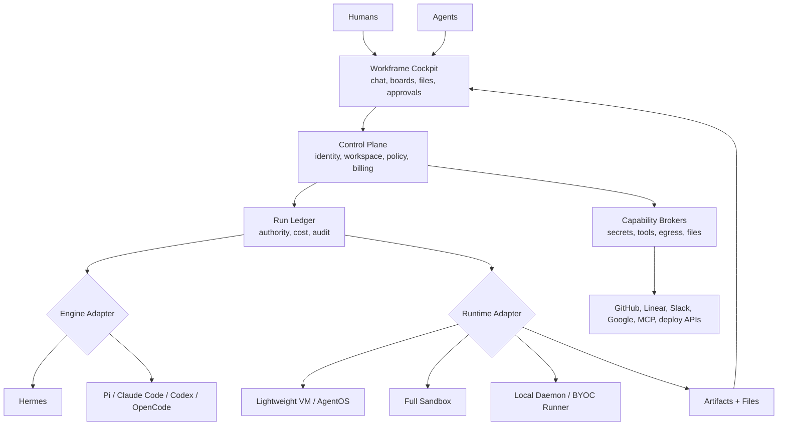
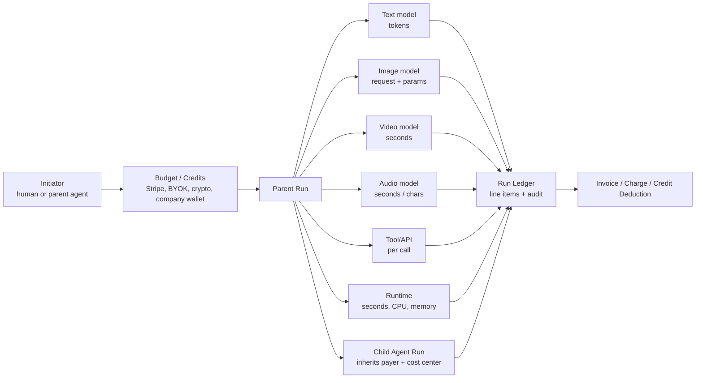
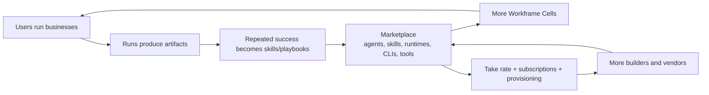

<div class="titlepage">

# Workframe v0.1.1

## The Social OS for Autonomous Businesses

**Investor, Product, Architecture, Deployment, and Monetization Brief**  
**Developed by Softsupply**

| Field | Value |
|---|---|
| Version | v0.1.1 |
| Date | June 23, 2026 |
| Product | Workframe |
| Developer | Softsupply |
| Repo anchor | `npx-workframe/workframe` |
| Inspected commit | `eddc7f2fe7c2` - `for comparison purposes` |
| Strategic focus | Workframe Cells, persistent agents, scoped runs, deployment modes, payment modes, marketplace expansion |

</div>

# Document Map

This package contains a master Markdown file, chapter-split Markdown files, Mermaid diagram sources, rendered diagram assets, and a PDF generated from the same Markdown content.

The revision updates Workframe from the prior v0.1.0 brief by making the following ideas first-class:

- **Tagline:** The Social OS for Autonomous Businesses.
- **Deployment modes:** local, Docker trusted team, VPS self-host with domain allowlist, Workframe-provisioned hosted/BYOC, and enterprise BYOC.
- **Payment modes:** default BYOK, opt-in company provider keys, hosted credits, run-level cost attribution, and future agent-to-agent payment rails.
- **Architecture doctrine:** runtimes, models, CLIs, and harnesses are replaceable; Workframe owns cells, runs, identity, files, policies, brokers, audit, and business state.
- **Commercial doctrine:** everyone ultimately exchanges time, files, and outcomes for money; Workframe should meter and govern the chain of runs that produces those outputs.


<div class="pagebreak"></div>

# Positioning

## Name

**Workframe**

## Tagline

**The Social OS for Autonomous Businesses**

## Description

Workframe is a private autonomous business cell where humans and persistent agents collaborate around files, boards, chat, schedules, and controlled computer runs to build and operate real businesses.

## Category

**Autonomous Business Operating System**

Alternative category labels:

| Label | When to use |
|---|---|
| Social OS for Autonomous Businesses | Public tagline and category creation |
| Agentic Business Control Plane | Technical/investor architecture discussions |
| Autonomous Team Runtime | Developer-facing runtime positioning |
| Workframe Cell Runtime | Deployment and infrastructure positioning |
| Human-Agent Collaboration Platform | Broader enterprise language |

## Tags

`autonomous business` · `social OS` · `AI agents` · `agentic workflows` · `human-agent collaboration` · `business operating system` · `agent runtime` · `BYOC` · `self-hosted AI` · `agent governance` · `agent marketplace` · `AI workspaces` · `autonomous studios` · `software factory` · `game dev studio` · `secure agent execution` · `run ledger` · `credential brokerage`

## One-sentence vision

**Workframe turns a team, its agents, its files, and its computers into an autonomous business cell.**

## Elevator pitch

Workframe is the Social OS for Autonomous Businesses: a private workspace where humans and persistent AI agents work together through chat, boards, files, schedules, and controlled computer runs. Unlike standalone chatbots, coding agents, or workflow tools, Workframe treats agents as persistent business actors with roles, skills, memories, budgets, permissions, and accountability. Humans define goals, approve sensitive actions, and steer the company; agents execute scoped work through auditable runs across code, documents, tools, and infrastructure. Workframe can run locally, as a trusted-team Docker install, as a self-hosted VPS at a customer domain, as a Workframe-provisioned cloud cell, or as an enterprise BYOC deployment.

## First-principles statement

Runtimes may change. Models come and go. CLI tools and agent harnesses are stackable and replaceable. The durable system is:

> **humans + persistent agents + computers = autonomous business productivity.**

Workframe exists to organize that system safely and commercially.


<div class="pagebreak"></div>

# One-Pager Executive Summary

## What Workframe is

Workframe is a private autonomous business operating system where humans and persistent agents collaborate as members of the same working organization. It combines the social coordination layer of a team workspace with the execution layer of agent runtimes, filesystems, schedulers, tools, credentials, and controlled computer environments.

The product is built around a simple first principle:

> Humans provide direction, judgment, and trust. Agents provide persistent labor. Computers provide execution. Workframe coordinates all three into an autonomous business cell.

Workframe is not just a chatbot, agent framework, workflow automation tool, or cloud IDE. It is a business control plane for agentic teams.

## The problem

AI agents are becoming capable of writing code, managing files, calling tools, browsing, deploying, testing, researching, producing assets, and coordinating work. But most current agent products are fragmented:

| Existing category | Missing layer |
|---|---|
| Chatbots | durable business state, files, tools, accountability |
| Coding agents | team governance, budgets, approvals, collaboration |
| Workflow tools | flexible reasoning and persistent agent identity |
| Agent frameworks | product UX, tenancy, billing, deployment packaging |
| Sandboxes | social collaboration and business memory |
| Self-hosted tools | managed updates, audit, provisioning, enterprise controls |

Businesses do not just need smarter agents. They need a way to govern agents as persistent workers inside real operational environments.

## The product

Workframe provides a private business cell where users create workspaces, invite team members, hire or configure agents, connect files and tools, assign work through boards and chat, schedule recurring jobs, and let agents execute controlled runs.

Core surfaces:

| Surface | Role |
|---|---|
| Social workspace | rooms, direct messages, mentions, approvals, live activity |
| Boards and tasks | visible business work for humans and agents |
| Persistent agents | named actors with roles, skills, memories, budgets, and permissions |
| Computer runs | scoped execution sessions with cost, artifacts, and audit |
| Credential brokerage | users and companies connect keys without exposing raw secrets to agents |
| Workframe Cells | deployment/isolation units for self-hosted, managed, hosted, and BYOC modes |

## Target wedge

The initial wedge is the **Auto Game Dev Shop** and adjacent autonomous studio workflows.

A small team can use Workframe to create an agentic studio where humans define the game vision, agents plan features, write code, produce tasks, review changes, run tests, generate docs, and maintain progress through recurring jobs.

Game development is a strong wedge because it naturally combines code, assets, project management, creative direction, QA, builds, release workflows, persistent files, team collaboration, and agent-assisted production.

## Why now

Models, agent harnesses, CLI tools, and runtime systems are improving quickly. But the model layer is volatile. The durable product opportunity is below the models:

```text
humans
agents
files
workspaces
tools
credentials
policies
runs
audit
business goals
```

As agents become more capable, teams need better systems to govern them. Workframe is designed to be that system.

## The business

Workframe monetizes through hosted SaaS, managed dedicated cells, BYOC deployment, self-hosted support, model/runtime credits, provisioning margin, template packs, and a future marketplace for agents, skills, playbooks, runtimes, CLIs, and tools.

The long-term thesis is direct:

> People and businesses exchange time and files for money. Workframe makes the chain of human-agent-computer work visible, governed, and billable.


<div class="pagebreak"></div>

# Core Doctrine and First Principles

## Stable vs replaceable layers

Workframe should separate stable business primitives from replaceable technical substrates.

| Stable Workframe-owned layer | Replaceable layer |
|---|---|
| humans, users, teams | model providers |
| workspaces and cells | LLM runtimes |
| persistent agents | agent harnesses |
| boards, files, rooms | CLI tools |
| runs and audit | coding agents |
| budgets and billing | sandbox providers |
| credentials and policies | external connectors |
| approvals and governance | local/hosted compute providers |

The mistake would be to tie Workframe's identity to Hermes, AgentOS, Claude Code, Codex, OpenCode, or any single model provider. Those tools are powerful but replaceable.

The durable opportunity is the business system that can host them.

## Agents as persistent business actors

Agents should not be disposable prompts only. In Workframe, an agent is a persistent business entity:

```text
agent_id
role
job description
skills
memory
allowed tools
allowed files
budget
manager
reporting line
runtime preference
approval rules
audit history
```

This enables an organization-like structure: game director, architect, engineer, designer, QA agent, release manager, support agent, researcher, accountant, or sales assistant.

## Computer runs as the unit of authority

A run is the moment where intent becomes action.

Every meaningful operation should become a run:

```text
chat mention
board assignment
cron job
webhook
manual action
sub-agent delegation
tool call
external message
file write
deployment
```

A run records:

```text
who initiated it
which agent acted
which workspace/cell it belongs to
which files were available
which tools were available
which credentials were leased
which model/runtime was used
which network destinations were allowed
what it cost
what artifacts were produced
what approvals were required
what happened
```

## Capabilities, not ambient authority

Agents should not receive raw secrets, broad filesystem access, full internet access, or human OAuth tokens. Agents should receive scoped capabilities:

```text
read these files
write to this artifact directory
open a PR in this repo
post a draft message
request a production deploy
use model provider through this lease
run this command in this runtime
```

The capability is granted to a run, not permanently to the profile.

## Files are economic output

The economy moves through files and outcomes:

```text
.ppt
.pdf
.dwg
.docx
.xlsx
.zip
repo commits
pull requests
deployments
videos
images
audio
contracts
reports
invoices
support responses
```

Workframe's product should make the production chain visible: who requested work, which agent produced it, which tools were used, what it cost, which files changed, and who approved the result.


<div class="pagebreak"></div>

# Deployment Modes

Deployment modes are not implementation detail. They are product packaging, trust posture, and monetization surface.


## Mode 1 - Local self-host

**Shape:** local install on Windows or macOS, with Hermes or another local agent harness.

| Attribute | Value |
|---|---|
| Buyer/user | developer, hacker, solo builder |
| Trust model | local machine trust |
| Runtime | local Hermes/native install, optional local daemon |
| Domain | localhost or LAN |
| Data | local files and local credentials |
| Payment | BYOK by default |
| Monetization | free OSS, optional cloud sync, marketplace, support |

This mode is the adoption wedge. It reduces friction and builds trust. It also preserves the local-first ethos: code and keys can remain on the user's machine.

## Mode 2 - Docker self-host, trusted team

**Shape:** Docker Compose deployment for a small trusted team.

| Attribute | Value |
|---|---|
| Buyer/user | small team, agency, studio, lab |
| Trust model | trusted members, shared infrastructure |
| Runtime | Docker gateway + API + UI + supervisor |
| Domain | internal host, tunnel, LAN, private URL |
| Data | local runtime volumes |
| Payment | BYOK or workspace provider keys |
| Monetization | support, templates, managed upgrade path |

This is the current practical Workframe mode. It is useful but should be honest: it is for trusted teams, not fully hostile multi-tenant internet use.

## Mode 3 - VPS self-host with customer domain

**Shape:** a customer deploys Workframe on a VPS and exposes it at a business domain such as `workframe.mybusiness.com`.

| Attribute | Value |
|---|---|
| Buyer/user | small business, studio, technical founder |
| Trust model | organization-controlled VPS |
| Runtime | Docker or packaged cell runtime |
| Domain | customer-controlled subdomain |
| Data | customer VPS storage/backups |
| Login | invite-only users, optional domain allowlist |
| Payment | BYOK default; optional company keys |
| Monetization | license, support, setup fee, provisioning referral/margin |

A critical feature here is identity policy:

```text
allow only invited users
allow only emails from mybusiness.com
allow contractors by explicit invite
allow agents only inside approved workspaces
```

This mode turns Workframe into a private business cell rather than an open social network.

## Mode 4 - Workframe-hosted provisioned cell

**Shape:** Workframe provisions and manages a cell with one click, either on Workframe infrastructure or inside a connected provider account.

Supported provisioning targets:

```text
Hostinger
Hetzner
AWS
GCP
Azure
custom VPS
Kubernetes/server cluster
```

| Attribute | Value |
|---|---|
| Buyer/user | small business that wants managed convenience |
| Trust model | managed cell with isolated deployment boundary |
| Runtime | Workframe-managed runtime stack |
| Domain | customer domain or Workframe-managed subdomain |
| Data | cell-local, with managed backup/restore |
| Payment | credits, BYOK, company keys, platform billing |
| Monetization | monthly cell fee, usage credits, provisioning margin, support |

This is likely the best commercial middle ground: more trusted than shared SaaS, easier than DIY self-hosting.

## Mode 5 - Enterprise BYOC with SSO

**Shape:** Workframe deploys into the customer's cloud/VPC with enterprise identity, network, audit, and support requirements.

| Attribute | Value |
|---|---|
| Buyer/user | enterprise, regulated team, larger technical organization |
| Trust model | customer cloud and customer security posture |
| Runtime | dedicated workers, optional private model endpoints |
| Identity | SSO/SAML/OIDC, SCIM, domain controls |
| Data | customer cloud, customer backups, optional CMK |
| Payment | annual contract, support, usage, private deployment |
| Monetization | enterprise license and support |

Enterprise mode should support:

```text
SSO
SCIM
customer-managed keys
private networking
audit export
admin policy console
SIEM integration
dedicated worker pools
private model routing
data residency
```

## Deployment mode principle

The product should not force one security/economics model onto every customer.

```text
Local = trust and adoption
Docker = trusted team productivity
VPS = private small-business cell
Provisioned = commercial managed cell
Enterprise BYOC = strategic accounts
```


<div class="pagebreak"></div>

# Payment and Credential Modes

Workframe needs two separate but related concepts:

1. **Who owns the credential?**
2. **Who pays for the run?**

The answer can be user, company, Workframe, cloud provider, marketplace vendor, or a future on-chain payment rail.

## Mode 1 - Default BYOK

BYOK should be the default.

Users connect their own provider accounts:

```text
OpenAI
Anthropic
OpenRouter
Google
DeepSeek
GitHub
Linear
Slack
Discord
Telegram
Google Workspace
MCP connectors
```

This gives Workframe strong early advantages:

| Advantage | Why it matters |
|---|---|
| Low COGS | Workframe does not front every model/tool bill |
| Trust | users know which accounts are connected |
| Adoption | self-hosted users can start without Workframe billing every token |
| Portability | users can move between local, VPS, BYOC, and managed modes |
| Compliance | companies can keep provider contracts directly |

BYOK should not mean agents see raw keys. The correct flow is:

```text
user connects account
secret stored in vault
run requests capability
Workframe issues short-lived lease
agent calls broker/proxy with lease
broker resolves real secret server-side
ledger records payer and run
lease expires/revokes
```

## Mode 2 - Company-level provider keys

Company-level keys are useful when a business wants centralized spend and centralized access.

This must be opt-in and policy-controlled.

Rules:

```text
company keys are never shown to users
agents never see raw company keys
users can trigger runs only if policy allows
all company-key usage is attributed to the initiating user/run
spend appears in workspace ledger
admins can revoke, rotate, and cap usage
sensitive tools require approval
```

This unlocks a real business workflow:

> A company can pay for the team's AI labor while still knowing exactly which user, agent, card, and run consumed the spend.

## Mode 3 - Workframe credits

For hosted/provisioned cells, Workframe can sell credits.

Credits abstract:

```text
text tokens
image generation requests
video seconds
audio generation/transcription
sandbox seconds
runtime CPU/memory
external tool calls
storage
egress
marketplace tool fees
```

The user sees simple budget controls. Workframe does the metering.

## Mode 4 - Hybrid company wallet

A workspace can use multiple funding sources:

| Work type | Payment source |
|---|---|
| personal experiments | user BYOK |
| official company tasks | company provider key or company credits |
| marketplace tools | workspace wallet |
| premium model burst | Workframe credits |
| enterprise private models | customer's provider contract |

The run ledger should record the funding source per line item.

## Mode 5 - Future agent-to-agent payments

Long term, Workframe can support agent-to-agent or run-to-run payment protocols:

```text
x402-style payment-gated API calls
crypto micropayments
stablecoin wallets
agent service invoices
marketplace tool billing
usage escrow
per-output payment
```

This should not be part of the first product's critical path. But the architecture should leave room for it by making every action a billable, auditable run line item.

## Credential-mode doctrine

The critical rule:

> Users may connect accounts. Companies may connect accounts. Agents may use capabilities. Agents should not possess secrets.

This gives Workframe the ability to support BYOK, company keys, hosted credits, enterprise contracts, and future micropayments without changing the core run model.


<div class="pagebreak"></div>

# Monetization by Deployment Mode

Workframe should monetize differently depending on trust boundary and operational burden.

| Deployment mode | Primary monetization | Secondary monetization | Why it works |
|---|---|---|---|
| Local self-host | free OSS | marketplace, support, cloud sync | adoption and developer trust |
| Docker trusted team | paid support, templates | managed upgrade path | teams want reliability without full SaaS |
| VPS self-host | license/support | provisioning margin, backup add-ons | private business cell with low COGS |
| Workframe-provisioned cell | monthly managed cell fee | usage credits, provisioning margin | best SMB revenue path |
| Shared hosted SaaS | subscription + usage | premium templates | fast onboarding and low friction |
| Enterprise BYOC | annual contract | support, compliance, private features | high trust, high ACV |

## Suggested commercial ladder

| Tier | Price range | Best fit | Core promise |
|---|---:|---|---|
| Open Source | Free | developers and hackers | run Workframe yourself |
| Local Plus | $10-$30/mo | local users | sync, templates, marketplace access |
| Starter SaaS | $50-$150/mo | small teams | hosted workspace, credits, limited agents |
| Studio Cell | $250-$750/mo | game/dev/content studios | managed dedicated cell |
| Business Cell | $750-$2,500/mo | agencies, SaaS factories | larger cell, audit, backups, more agents |
| BYOC | $500-$5,000/mo | technical businesses | deploy into customer cloud, managed updates |
| Enterprise | $3,000-$25,000+/mo | larger organizations | SSO, private network, audit, support |

## Why managed cells are the commercial center

Managed cells create a natural value story:

```text
This is your autonomous business server.
Your team, agents, files, jobs, keys, and logs live here.
Softsupply manages deployment, updates, backups, and support.
```

This is easier to price than a generic shared chatbot subscription.

## Credit packaging

Workframe should sell credits as operational capacity, not as raw tokens:

```text
frontier agent-hours
mini agent-hours
image generation credits
video seconds
sandbox hours
runtime CPU/memory seconds
premium connector calls
marketplace tool credits
```

Internally, every credit maps to a run line item.

## Marketplace expansion

Future marketplace categories:

| Marketplace category | Examples |
|---|---|
| Agents | game designer, QA agent, release manager, sales assistant |
| Skills | bug triage, PR review, level-design checklist, investor update |
| Playbooks | ship weekly build, produce game pitch deck, launch SaaS MVP |
| Runtimes | AgentOS runtime, browser runtime, Unity build runtime, GPU runtime |
| CLIs | Claude Code, Codex, OpenCode, Pi, Hermes profiles |
| Tools | GitHub PR tool, Linear sync, Google Drive export, Slack notifier |
| Connectors | Telegram, Discord, Slack, GitHub, Linear, Google Workspace, MCP |
| Cell images | Auto Game Dev Shop, SaaS Factory, Content Studio, Support Desk |
| Model routes | frontier/cheap/private/local model policies |

Marketplace monetization:

```text
one-time purchase
monthly subscription
usage-based tool fees
template license
revenue share
take rate
verified publisher fee
enterprise-certified connector fee
```

The marketplace is not day-one. It becomes powerful once runs, capabilities, and cells are stable.


<div class="pagebreak"></div>

# Run Economics and Billable Chains

Workframe should treat a run as both a technical execution record and an economic packet.


## The run as economic packet

A run can include many line items:

| Line item | Meter |
|---|---|
| Text model | input tokens, cached tokens, output tokens, reasoning tokens |
| Image generation | request, size, quality, model, count |
| Video generation | seconds, resolution, model, priority |
| Audio generation | seconds, characters, voices, transcription minutes |
| Tool call | API call, connector call, premium operation |
| Runtime | wall-clock seconds, CPU, memory, GPU, storage |
| Sandbox | session minutes, container/microVM cost |
| Egress | bytes, destination class |
| Storage | artifact size, retention period |
| Marketplace | vendor tool fee, skill fee, playbook fee |
| Human approval | optional service workflow cost in managed offerings |

The user sees a clear ledger. The platform sees unit economics.

## Parent and child runs

Agents can delegate. A parent run can spawn child runs:

```text
user asks Director Agent to make a trailer
Director Agent delegates:
  Writer Agent -> script
  Art Agent -> image prompts
  Video Agent -> clips
  Audio Agent -> narration
  Editor Agent -> final render
```

All child runs inherit:

```text
initiator
workspace
budget
cost center
approval policy
ledger lineage
```

This lets Workframe concatenate work chains and bill them correctly.

## Payment rails

Payment can be settled through:

```text
BYOK provider accounts
company provider keys
Workframe credits
Stripe subscription/invoice
prepaid usage wallet
enterprise contract
crypto/stablecoin future rail
x402-style per-request payment future rail
```

The payment rail is replaceable. The run ledger remains stable.

## Why this matters

Today, businesses exchange files and services for money:

```text
presentation decks
CAD drawings
PDF reports
code repositories
spreadsheets
design assets
videos
audio clips
contracts
support replies
```

Agents will produce these outputs through chains of paid model/tool/runtime calls. Workframe should be the place where those chains are visible, governed, and paid.

## Pricing implication

Do not sell unlimited autonomy. Sell governed work capacity.

Examples:

| Offer | Better framing |
|---|---|
| 10 hours of GPT-5.5 | 10 frontier run-hours with token and tool caps |
| 50 hours of mini model | 50 lightweight agent-hours with runtime limits |
| Unlimited agents | up to N active agents and M concurrent runs |
| Free builds | included sandbox/runtime credits |
| BYOK | user/company pays provider directly; Workframe still logs and governs runs |

This makes costs understandable and defensible.


<div class="pagebreak"></div>

# Connectors, Accounts, and Identity

Workframe should let users and companies connect the accounts where business already happens.

## Account connections

Priority connectors:

```text
Telegram
Discord
Slack
GitHub
Linear
Google Workspace
Gmail
Google Drive
Google Calendar
Vercel
Netlify
Stripe
Figma
Notion
MCP servers
custom API keys
```

## Connector doctrine

Each connector must answer:

```text
who connected it?
who owns it?
which workspace can use it?
which agents can request it?
which actions are allowed?
which actions require approval?
which runs used it?
what did it cost?
what data was read or written?
```

## User vs company accounts

| Account type | Example | Default policy |
|---|---|---|
| User-owned | personal GitHub, personal Slack, personal OpenAI key | only the owner can delegate |
| Company-owned | workspace GitHub app, company OpenAI key, deployment provider | admins define usage policy |
| Service-owned | Workframe-managed credits, marketplace tool account | billed to workspace or account |
| External vendor | premium agent/tool marketplace | accessed through marketplace contract |

## Domain allowlist

For VPS/self-hosted business cells, domain allowlist is a major trust feature:

```text
only users with @mybusiness.com can request access
contractors need explicit invite
agents cannot invite humans
admins approve external guests
workspace owners can disable public signup entirely
```

## MCP connector posture

MCP connectors are powerful but risky. Workframe should treat MCP servers as tools with declared capabilities:

```text
server identity
available tools
required secrets
allowed network destinations
workspace scope
risk tier
approval requirement
run audit
```

MCP should not become an unbounded backdoor into user data or external tools.


<div class="pagebreak"></div>

# Target Architecture

The target architecture separates cockpit, control plane, runtime adapters, engine adapters, brokers, and deployment cells.


## Workframe-owned stable layers

| Layer | Responsibility |
|---|---|
| Identity | users, organizations, workspaces, roles, SSO/domain allowlist |
| Social cockpit | rooms, DMs, live turns, approvals, notifications |
| Business state | boards, cards, goals, files, artifacts, decisions |
| Agent registry | persistent agents, roles, skills, memory, budgets |
| Run ledger | authority, status, cost, events, artifacts, audit |
| Policy engine | what actors can do under what conditions |
| Credential broker | BYOK, company keys, leases, rotation, revocation |
| Tool broker | GitHub, Slack, Linear, deploys, email, MCP, custom tools |
| Egress broker | network allowlists, proxying, exfiltration controls |
| Billing engine | credits, invoices, line items, marketplace settlement |
| Cell manager | local, Docker, VPS, provisioned, BYOC, enterprise deployments |

## Replaceable adapters

| Adapter type | Examples |
|---|---|
| Engine adapter | Hermes, Pi, Claude Code, Codex, OpenCode, AG2-style orchestrators |
| Runtime adapter | Hermes profile runtime, AgentOS lightweight VM, local daemon, full sandbox, microVM, Kubernetes job |
| Model adapter | OpenAI, Anthropic, OpenRouter, Google, DeepSeek, local model gateway |
| Tool adapter | GitHub, Linear, Slack, Google Workspace, Vercel, Netlify, MCP |
| Payment adapter | Stripe, credits, enterprise invoice, crypto/x402 future rails |

## Control flow

```text
human or agent creates intent
intent becomes card/message/trigger
Workframe creates run
policy engine grants capabilities
runtime adapter starts execution
engine adapter performs reasoning/tool loop
brokers mediate secrets/tools/files/network
run ledger records events and costs
artifacts return to files/boards/chat
approval gates promote sensitive outputs
billing settles line items
```

## Why adapter-first matters

Hermes is valuable today. AgentOS-style runtimes may become valuable tomorrow. Pi, Claude Code, Codex, OpenCode, AG2, and local daemon approaches may each win different niches.

Workframe should not choose one forever. Workframe should govern all of them.


<div class="pagebreak"></div>

# Current State of the Codebase

## Repo anchor

| Field | Value |
|---|---|
| Repository | `npx-workframe/workframe` |
| Latest inspected commit | `eddc7f2fe7c2eb4a0fee24a150201428ea430c7a` |
| Commit message | `for comparison purposes` |
| Product version in this brief | `v0.1.1` |

## Active surfaces

The current repository identifies these active surfaces:

| Surface | Role |
|---|---|
| `apps/web` | Product UI, Vite/React |
| `services/workframe-api` | Python BFF, canonical backend |
| `packages/create-workframe` | npm installer |
| `packages/workframe` | lifecycle CLI |
| `infra/compose/workframe` | Docker gateway, dashboard, API, supervisor, UI |
| `scripts/workframe` | bootstrap, tunnels, install identity |
| `runtime/` | Agents, Files, API data, not in git |

## What is strong already

| Existing primitive | Why it matters |
|---|---|
| Workspaces and rooms | social substrate is real |
| Provider connect UX | user/company account model is emerging |
| Per-user runtime profiles | first step away from shared agent identity |
| Credential vault | secrets are moving out of Hermes runtime files |
| `wf_rt_` turn leases | correct capability pattern for model access |
| Internal LLM proxy | real upstream keys can stay server-side |
| Supervisor | Docker socket can be isolated from API path |
| Secure/dev unsafe split | correct deployment posture separation |
| Dashboard auth gate | Hermes dashboard exposure is being controlled |
| E2E/RBAC/security tests | security behavior is testable, not only documented |

## What remains prototype-shaped

| Area | Issue |
|---|---|
| Docker socket | API still has physical socket mount in current compose and should lose it |
| Broad volumes | API/gateway still see broad `runtime/Agents` and `runtime/Files` mounts |
| Per-turn env overlay | model secrets can still be written into profile `.env` paths in current flow |
| Profile authority | Hermes profiles carry too much execution authority |
| Space mentions | template profile model needs run-scoped payer/capability semantics |
| Filesystem access | no first-class run file manifest yet |
| Egress | no Workframe-owned default-deny egress broker yet |
| Run ledger | run is not yet the universal action/economic primitive |
| Billing | costs are not yet line-itemed by run and funding source |

## Current-system diagram


## Interpretation

The current codebase is not wrong. It is a practical cockpit around Hermes. The next stage is not a rewrite. The next stage is to pull authority upward into Workframe-owned runs, leases, capabilities, file manifests, brokers, and ledgers.


<div class="pagebreak"></div>

# Required Product Security

## Security doctrine

Agents are useful precisely because they can act. That makes them dangerous if they receive ambient authority.

The required posture:

```text
agents do not receive raw secrets
agents do not get whole-workspace filesystem access by default
agents do not get unrestricted outbound internet by default
agents do not inherit user OAuth tokens automatically
agents do not create broader sub-agents
agents do not deploy production without policy
agents do not spend unlimited money
```

## Credential security

All sensitive credentials should flow through the broker model:

```text
user/company connects account
secret is stored in vault/KMS
run requests capability
policy evaluates request
short-lived lease is issued
broker resolves real credential server-side
agent receives only opaque token/capability
run ends, lease expires or is revoked
ledger records usage
```

## Company provider keys without exfiltration

A company-level provider key can be safe enough if:

```text
users cannot read it
agents cannot print it
runtime only receives lease tokens
all calls go through proxy/broker
ledger attributes cost to user/agent/run/card
admins can revoke and rotate
spend is capped
sensitive output requires approval
```

The key idea is not secrecy by prompt instruction. It is secrecy by architecture.

## Filesystem security

Every run should eventually have a file manifest:

```json
{
  "run_id": "run_123",
  "mounts": [
    { "source": "project://game/repo", "target": "/work/repo", "mode": "rw" },
    { "source": "project://game/brand", "target": "/work/brand", "mode": "ro" }
  ],
  "denied": ["workspace://other-project/*", "user://private/*"]
}
```

A run should not see files merely because they exist somewhere in the same VPS or volume.

## Egress security

Exfiltration cannot be fully prevented if an agent can both read sensitive data and communicate freely. Therefore Workframe should separate access and output.

Controls:

```text
default-deny outbound internet
allowlist model providers through model gateway
allowlist GitHub/GitLab through tool broker
allow package registries through cache/proxy
block direct SMTP/chat/webhooks unless brokered
block cloud metadata/private IP access
log network destinations
scan/redact outputs where possible
require approval for external sends
```

## Tool security

Tools should be capabilities, not raw shell access.

Example:

```json
{
  "tool": "github.open_pull_request",
  "scope": {
    "workspace": "game-studio",
    "repo": "space-runner",
    "branch_prefix": "agent/",
    "actions": ["create_branch", "commit", "open_pr"]
  },
  "approval_required": false,
  "ttl_seconds": 900
}
```

## Audit security

A customer should be able to answer:

```text
who initiated this?
which agent acted?
which files were read?
which files were written?
which credentials were used?
which external tools were called?
which network destinations were contacted?
what did it cost?
which approvals happened?
what artifact was produced?
```

That is the trust product.


<div class="pagebreak"></div>

# Roadmap from Current Workframe

The roadmap should avoid a rewrite. Preserve the current product, but move authority into Workframe-owned primitives.

## Phase 0 - Vocabulary lock

Define and use these terms consistently:

```text
Cell
Workspace
Room
Board
Card
Actor
AgentProfile
Run
Runtime
Engine
Capability
Lease
Artifact
AuditEvent
BillingEvent
```

Stop using Hermes profile as a catch-all for agent, runtime, session, authority, and memory.

## Phase 1 - Harden current stack

Immediate work:

```text
remove Docker socket from workframe-api
keep socket only in supervisor
put arbitrary exec behind dev-unsafe only
route all model usage through LLM proxy and wf_rt leases
stop writing raw model keys into profile .env for turns
store provider metadata separately from secrets
add tests proving API cannot access Docker socket
```

## Phase 2 - Add Workframe-owned runs

Add minimum tables:

```sql
runs(
  id,
  workspace_id,
  room_id,
  card_id,
  actor_type,
  actor_id,
  triggering_user_id,
  engine,
  runtime,
  status,
  risk_tier,
  budget_usd,
  created_at,
  started_at,
  ended_at
)
```

```sql
run_events(
  id,
  run_id,
  event_type,
  payload_json,
  created_at
)
```

```sql
run_line_items(
  id,
  run_id,
  funding_source,
  vendor,
  meter,
  quantity,
  unit_cost,
  total_cost,
  created_at
)
```

Then make these create runs:

```text
agent DM
space @mention
card assignment
cron job
manual slash command
external webhook
```

## Phase 3 - Tool and credential brokers

Generalize the existing LLM proxy pattern:

```text
LLM proxy -> model broker
GitHub actions -> git broker
Slack/Discord/TG -> message broker
Vercel/Netlify -> deploy broker
Google Workspace -> document/mail/calendar broker
MCP -> capability-filtered tool broker
```

## Phase 4 - Runtime/engine adapter seam

Introduce two interfaces:

```text
EngineAdapter:
  Hermes
  Pi
  Claude Code
  Codex
  OpenCode
  AG2-style orchestrator

RuntimeAdapter:
  Hermes profile runtime
  AgentOS lightweight VM
  local daemon
  full sandbox
  BYOC runner
  Kubernetes job
```

This makes future runtimes additive instead of disruptive.

**Implementation status (2026-06-26):** Design only. Near-term delivery split into two steps in `docs/workframe/`:

| Step | Scope | Doc |
|------|-------|-----|
| 1 | `runtime_kind`, host resolver, NemoHermes stub, Stripe broker, supervisor guard | `adapter-step1-runtime-seam.md` |
| 2 | `EngineAdapter` / `RuntimeAdapter` Protocol extract; Hermes as first implementation | `adapter-step2-engine-extract.md` |

Build checklist: `adapter-build-roadmap.md`. Upstream refs (Hermes, NemoClaw): `adapter-external-references.md`.

## Phase 5 - File manifests and artifacts

Move from broad workspace mounts to run-scoped file manifests.

Early implementation:

```text
copy allowed files into run workspace
agent writes artifacts
human or policy promotes artifacts back
ledger records file diff
```

Later implementation:

```text
overlay filesystem
object storage backend
git branch mount
AgentOS virtual filesystem
sandbox bind mounts
```

## Phase 6 - Workframe Cell productization

Add cell metadata:

```text
cell_id
deployment_mode
owner_workspace
version
health
update_channel
runtime_capacity
backup_config
secret_mode
egress_mode
installed_adapters
license_state
```

Build tooling for:

```text
install
upgrade
backup
restore
health check
domain setup
email allowlist
provider connect
usage export
support bundle
```

## Phase 7 - Provisioned/BYOC control plane

Build the cloud-side manager for:

```text
provisioning VPS/cloud cells
tracking cell versions
pushing updates
licensing
billing
usage credits
template installation
marketplace access
support diagnostics
```

## Phase 8 - Marketplace and payment rails

Only after runs, capabilities, and billing are stable:

```text
agent marketplace
skill marketplace
playbook marketplace
runtime marketplace
connector marketplace
agent-to-agent payments
x402/crypto experiments
```


<div class="pagebreak"></div>

# User Journeys

## Journey 1 - Local solo builder

1. User installs Workframe locally.
2. Workframe detects or configures Hermes/local agent harness.
3. User connects BYOK model provider.
4. User creates an Auto Game Dev workspace.
5. Workframe creates default agents: Director, Engineer, Designer, QA.
6. User chats with Director Agent.
7. Director creates board cards.
8. Engineer Agent starts scoped runs against local files.
9. User reviews artifacts and approves changes.
10. Repeated workflows become playbooks.

## Journey 2 - Trusted Docker team

1. Founder deploys Workframe via Docker Compose.
2. Invites trusted team members.
3. Each member connects their own provider keys.
4. Team creates project rooms and boards.
5. Agents are assigned tasks through boards and mentions.
6. Runs are logged to the workspace ledger.
7. The team upgrades to managed VPS when project becomes serious.

## Journey 3 - VPS self-host with company domain

1. Business deploys Workframe to a VPS.
2. DNS points `workframe.mybusiness.com` to the instance.
3. Owner enables email-domain allowlist for `mybusiness.com`.
4. Contractors require explicit invites.
5. Admin connects company-level model provider key.
6. Users trigger runs; provider cost is attributed to users/cards/runs.
7. Owner reviews ledger, artifacts, approvals, and spend.

## Journey 4 - Workframe-provisioned cell

1. Customer signs up for managed Workframe Cell.
2. Chooses Hostinger, Hetzner, AWS, GCP, or Workframe-hosted infrastructure.
3. Connects domain and identity policy.
4. Workframe provisions the cell.
5. Customer installs Auto Game Dev Shop template.
6. Workframe manages updates, backups, health, and usage credits.
7. Customer upgrades runtime capacity as agent usage grows.

## Journey 5 - Enterprise BYOC

1. Enterprise signs annual contract.
2. Workframe deploys into customer cloud/VPC.
3. SSO/SAML and SCIM are configured.
4. Customer-managed keys and private networking are enabled.
5. Internal teams create Workframe Cells per business unit/project.
6. Agents operate only through approved tools and private model endpoints.
7. Audit logs export to SIEM.
8. Enterprise adds custom templates and internal marketplace packages.

## Journey 6 - Marketplace purchase

1. User browses marketplace.
2. Installs "Game QA Agent" or "Weekly Build Playbook."
3. Workframe shows requested capabilities, cost model, and publisher.
4. Admin approves installation.
5. The agent/playbook becomes available in selected workspaces.
6. Runs created by the package are line-itemed and auditable.
7. Marketplace vendor earns usage or subscription revenue.


<div class="pagebreak"></div>

# Marketplace Expansion

The marketplace should emerge from the run/capability architecture, not precede it.


## What can be marketed

Almost everything in the Workframe ecosystem can eventually become a marketplace object:

| Object | Marketplace form |
|---|---|
| Agent | installable worker/persona with role, prompts, tools, memory seed |
| Skill | reusable task capability or `SKILL.md` style package |
| Playbook | multi-step workflow with triggers, cards, approvals, runs |
| Runtime | managed execution backend or adapter |
| CLI | packaged integration for Codex, Claude Code, Pi, OpenCode, Hermes |
| Tool | brokered capability with schema and pricing |
| Connector | Slack, GitHub, Linear, Google Workspace, MCP server |
| Template | Auto Game Dev Shop, SaaS Factory, Content Studio |
| Cell image | preconfigured deployment bundle |
| Model route | routing policy for cheap/frontier/private models |

## Marketplace governance

Marketplace packages should declare:

```text
publisher
version
permissions
required connectors
required secrets
network destinations
pricing model
risk tier
supported runtimes
audit events
uninstall behavior
```

## Marketplace monetization

Potential models:

```text
one-time install fee
monthly subscription
usage fee per run
usage fee per tool call
revenue share
enterprise-certified fee
verified publisher fee
runtime capacity fee
```

## Agent-to-agent economy

Long term, agents can pay other agents or tools for work:

```text
Research Agent pays Data API Tool
Design Agent pays Image Tool
Video Agent pays Render Runtime
Sales Agent pays Enrichment Connector
Build Agent pays Sandbox Runtime
```

The initiator ultimately funds the chain. The run ledger keeps the chain accountable.

This is where x402, crypto micropayments, stablecoin rails, and payment-gated APIs may become useful. They are not the core Workframe MVP, but the architecture should not block them.


<div class="pagebreak"></div>

# Financial Model and Growth Estimates

These are planning estimates for product strategy and packaging.

## Revenue model by customer type

| Customer type | Likely product | Monthly revenue | Variable cost profile |
|---|---|---:|---|
| solo hacker | local/self-host | $0-$30 | minimal, mostly marketplace/support |
| small team | shared hosted | $50-$150 | model/runtime credits |
| indie studio | managed cell | $250-$750 | VPS/server + credits + support |
| agency/factory | business cell | $750-$2,500 | more runtime + storage + support |
| technical SMB | BYOC | $500-$5,000 | low infra COGS, higher support |
| enterprise | enterprise BYOC | $3,000-$25,000+ | support/compliance/customer success |

## Example monthly unit economics

| Plan | Price | Included variable budget | Infra/support reserve | Gross contribution target |
|---|---:|---:|---:|---:|
| Starter SaaS | $100 | $35-$50 | $10-$20 | $30-$55 |
| Studio Cell | $500 | $100-$200 | $75-$150 | $150-$325 |
| Business Cell | $1,000 | $200-$400 | $150-$250 | $350-$650 |
| BYOC Support | $1,000 | $0-$100 | $100-$250 | $650-$900 |
| Enterprise | $5,000 | contract-specific | $500-$1,500 | $2,500-$4,500 |

## Growth scenario

| Stage | Customers | Mix | MRR estimate |
|---|---:|---|---:|
| Design partners | 10 | mostly free/self-host | $0-$2k |
| Early pilots | 25 | 10 paid cells, 15 self-host | $5k-$15k |
| Seed traction | 100 | 40 starter, 40 studio, 15 BYOC, 5 enterprise pilots | $40k-$120k |
| Expansion | 500 | hosted + managed + BYOC mix | $250k-$750k |
| Marketplace phase | 2,000+ | platform + ecosystem revenue | $1M+ potential MRR |

## Workspaces and cells

| Metric | Early | Growth | Scale |
|---|---:|---:|---:|
| registered users | 500 | 10,000 | 100,000 |
| active workspaces | 50 | 1,000 | 10,000 |
| managed cells | 10 | 200 | 2,000 |
| BYOC cells | 5 | 100 | 1,000 |
| monthly runs | 10,000 | 1M | 100M |
| marketplace packages | 25 | 500 | 10,000 |

## COGS posture

BYOK and BYOC are strategically important because they reduce Workframe's need to front all model and compute costs.

| Mode | COGS burden on Workframe |
|---|---|
| Local BYOK | very low |
| Docker self-host BYOK | very low |
| VPS self-host | low, unless managed support included |
| Workframe-provisioned managed cell | medium |
| Shared hosted SaaS | higher, requires tight metering |
| Enterprise BYOC | low infrastructure COGS, higher support cost |

## Financial principle

Workframe should avoid becoming an unlimited AI usage wrapper. The product should sell governed business capacity:

```text
users
agents
workspaces
cells
runs
credits
connectors
runtime capacity
support
marketplace packages
```

The run ledger is the foundation of both trust and billing.


<div class="pagebreak"></div>

# Tests, Validation, and Success Criteria

## Product validation

The product is working if teams use Workframe weekly to run real projects.

Leading indicators:

```text
weekly active workspaces
runs per workspace
cards created by agents
cards completed by agents
artifacts produced
approvals requested
repeat scheduled jobs
provider accounts connected
team members invited
agent retention
```

## Security validation

Required tests:

```text
API has no Docker socket in secure mode
raw provider keys never appear in Hermes .env during turns
LLM proxy rejects invalid/expired leases
lease provider mismatch is rejected
member cannot access owner dashboard
user-only credentials do not cross users
company key usage is attributed to initiating user/run
agent cannot read files outside run manifest
tool call without capability is rejected
egress to blocked destinations is denied
```

## Billing validation

Required tests:

```text
every run has a payer/funding source
every model call creates line item
every marketplace tool call creates line item
child runs inherit parent cost center
budget exceeded stops run or requires approval
workspace ledger sums to invoice/credit deduction
```

## Deployment validation

Required tests by mode:

| Mode | Required validation |
|---|---|
| Local | installs, starts, connects provider, runs first agent |
| Docker trusted team | invite user, connect BYOK, run agent, see ledger |
| VPS self-host | domain works, email allowlist works, backups work |
| Provisioned cell | one-click deploy, health check, upgrade, restore |
| Enterprise BYOC | SSO, audit export, private network, CMK path |

## Success if

Near-term success:

```text
Workframe can run a real Auto Game Dev Shop pilot
users return weekly
agents produce visible artifacts
company/user provider keys are safe enough for trusted teams
runs are logged and billable
```

Medium-term success:

```text
managed cells sell repeatedly
BYOC deploys work reliably
runtime adapters are real
marketplace packages start emerging
```

Long-term success:

```text
Workframe becomes the default cockpit for operating autonomous teams and businesses
```


<div class="pagebreak"></div>

# Final Recommendation

The revised strategy is simple:

```text
Workframe is the Social OS for Autonomous Businesses.
```

The durable first principles are:

```text
humans
persistent agents
computers
files
runs
budgets
credentials
policies
audit
```

The replaceable substrates are:

```text
models
agent harnesses
runtimes
CLI tools
connectors
payment rails
cloud providers
```

## What to build next

Build the Workframe authority layer:

```text
run ledger
credential leases everywhere
tool brokers
file manifests
egress policy
runtime adapters
cell manager
billing line items
```

Do not over-invest in owning the agent brain too early. Keep Hermes strong. Add AgentOS/Pi/Claude Code/Codex/OpenCode/local daemon adapters as the ecosystem evolves.

## What to sell first

Sell private autonomous business cells:

```text
Auto Game Dev Shop
SaaS Factory
Content Studio
Support Desk
Research Desk
Agency Cell
```

The most commercial package is likely:

```text
managed Workframe Cell
+ BYOK/company keys
+ run ledger
+ default agents
+ playbooks
+ support
+ optional usage credits
```

## The final product image

A customer should be able to say:

> This is our autonomous business cell. Our humans, agents, files, tools, budgets, and computer runs live here. We can see what happened, what it cost, what it touched, who approved it, and what came out.

That is the product.


<div class="pagebreak"></div>

# Appendix: Mermaid Diagram Sources

## 01-first-principles



## 02-deployment-modes



## 03-current-system



## 04-target-system



## 05-run-billing-chain



## 06-marketplace-flywheel


