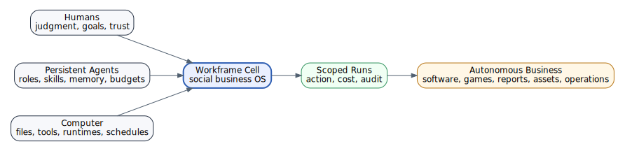

# Positioning

## Name

**Workframe**

## Tagline

**The Social OS for Autonomous Businesses**

## Description

Workframe is a private autonomous business cell where humans and persistent agents collaborate around files, boards, chat, schedules, and controlled computer runs to build and operate real businesses.

## Category

**Autonomous Business Operating System**

Alternative category labels:

| Label | When to use |
|---|---|
| Social OS for Autonomous Businesses | Public tagline and category creation |
| Agentic Business Control Plane | Technical/investor architecture discussions |
| Autonomous Team Runtime | Developer-facing runtime positioning |
| Workframe Cell Runtime | Deployment and infrastructure positioning |
| Human-Agent Collaboration Platform | Broader enterprise language |

## Tags

`autonomous business` · `social OS` · `AI agents` · `agentic workflows` · `human-agent collaboration` · `business operating system` · `agent runtime` · `BYOC` · `self-hosted AI` · `agent governance` · `agent marketplace` · `AI workspaces` · `autonomous studios` · `software factory` · `game dev studio` · `secure agent execution` · `run ledger` · `credential brokerage`

## One-sentence vision

**Workframe turns a team, its agents, its files, and its computers into an autonomous business cell.**

## Elevator pitch

Workframe is the Social OS for Autonomous Businesses: a private workspace where humans and persistent AI agents work together through chat, boards, files, schedules, and controlled computer runs. Unlike standalone chatbots, coding agents, or workflow tools, Workframe treats agents as persistent business actors with roles, skills, memories, budgets, permissions, and accountability. Humans define goals, approve sensitive actions, and steer the company; agents execute scoped work through auditable runs across code, documents, tools, and infrastructure. Workframe can run locally, as a trusted-team Docker install, as a self-hosted VPS at a customer domain, as a Workframe-provisioned cloud cell, or as an enterprise BYOC deployment.

## First-principles statement

Runtimes may change. Models come and go. CLI tools and agent harnesses are stackable and replaceable. The durable system is:

> **humans + persistent agents + computers = autonomous business productivity.**

Workframe exists to organize that system safely and commercially.

