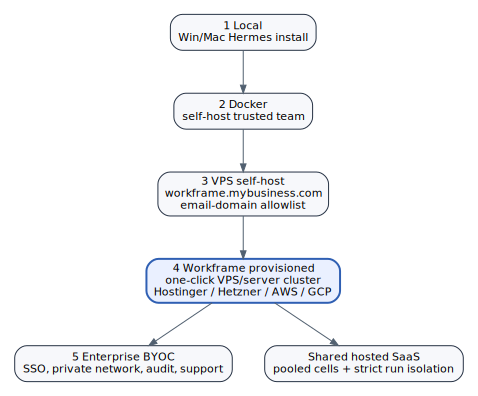

# Deployment Modes

Deployment modes are not implementation detail. They are product packaging, trust posture, and monetization surface.



## Mode 1 - Local self-host

**Shape:** local install on Windows or macOS, with Hermes or another local agent harness.

| Attribute | Value |
|---|---|
| Buyer/user | developer, hacker, solo builder |
| Trust model | local machine trust |
| Runtime | local Hermes/native install, optional local daemon |
| Domain | localhost or LAN |
| Data | local files and local credentials |
| Payment | BYOK by default |
| Monetization | free OSS, optional cloud sync, marketplace, support |

This mode is the adoption wedge. It reduces friction and builds trust. It also preserves the local-first ethos: code and keys can remain on the user's machine.

## Mode 2 - Docker self-host, trusted team

**Shape:** Docker Compose deployment for a small trusted team.

| Attribute | Value |
|---|---|
| Buyer/user | small team, agency, studio, lab |
| Trust model | trusted members, shared infrastructure |
| Runtime | Docker gateway + API + UI + supervisor |
| Domain | internal host, tunnel, LAN, private URL |
| Data | local runtime volumes |
| Payment | BYOK or workspace provider keys |
| Monetization | support, templates, managed upgrade path |

This is the current practical Workframe mode. It is useful but should be honest: it is for trusted teams, not fully hostile multi-tenant internet use.

## Mode 3 - VPS self-host with customer domain

**Shape:** a customer deploys Workframe on a VPS and exposes it at a business domain such as `workframe.mybusiness.com`.

| Attribute | Value |
|---|---|
| Buyer/user | small business, studio, technical founder |
| Trust model | organization-controlled VPS |
| Runtime | Docker or packaged cell runtime |
| Domain | customer-controlled subdomain |
| Data | customer VPS storage/backups |
| Login | invite-only users, optional domain allowlist |
| Payment | BYOK default; optional company keys |
| Monetization | license, support, setup fee, provisioning referral/margin |

A critical feature here is identity policy:

```text
allow only invited users
allow only emails from mybusiness.com
allow contractors by explicit invite
allow agents only inside approved workspaces
```

This mode turns Workframe into a private business cell rather than an open social network.

## Mode 4 - Workframe-hosted provisioned cell

**Shape:** Workframe provisions and manages a cell with one click, either on Workframe infrastructure or inside a connected provider account.

Supported provisioning targets:

```text
Hostinger
Hetzner
AWS
GCP
Azure
custom VPS
Kubernetes/server cluster
```

| Attribute | Value |
|---|---|
| Buyer/user | small business that wants managed convenience |
| Trust model | managed cell with isolated deployment boundary |
| Runtime | Workframe-managed runtime stack |
| Domain | customer domain or Workframe-managed subdomain |
| Data | cell-local, with managed backup/restore |
| Payment | credits, BYOK, company keys, platform billing |
| Monetization | monthly cell fee, usage credits, provisioning margin, support |

This is likely the best commercial middle ground: more trusted than shared SaaS, easier than DIY self-hosting.

## Mode 5 - Enterprise BYOC with SSO

**Shape:** Workframe deploys into the customer's cloud/VPC with enterprise identity, network, audit, and support requirements.

| Attribute | Value |
|---|---|
| Buyer/user | enterprise, regulated team, larger technical organization |
| Trust model | customer cloud and customer security posture |
| Runtime | dedicated workers, optional private model endpoints |
| Identity | SSO/SAML/OIDC, SCIM, domain controls |
| Data | customer cloud, customer backups, optional CMK |
| Payment | annual contract, support, usage, private deployment |
| Monetization | enterprise license and support |

Enterprise mode should support:

```text
SSO
SCIM
customer-managed keys
private networking
audit export
admin policy console
SIEM integration
dedicated worker pools
private model routing
data residency
```

## Deployment mode principle

The product should not force one security/economics model onto every customer.

```text
Local = trust and adoption
Docker = trusted team productivity
VPS = private small-business cell
Provisioned = commercial managed cell
Enterprise BYOC = strategic accounts
```
