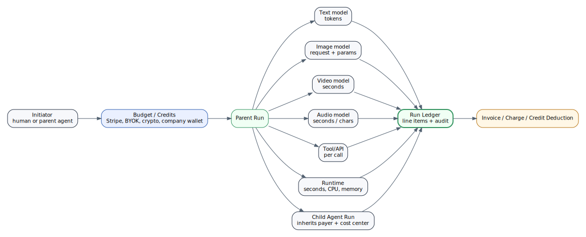

# Run Economics and Billable Chains

Workframe should treat a run as both a technical execution record and an economic packet.



## The run as economic packet

A run can include many line items:

| Line item | Meter |
|---|---|
| Text model | input tokens, cached tokens, output tokens, reasoning tokens |
| Image generation | request, size, quality, model, count |
| Video generation | seconds, resolution, model, priority |
| Audio generation | seconds, characters, voices, transcription minutes |
| Tool call | API call, connector call, premium operation |
| Runtime | wall-clock seconds, CPU, memory, GPU, storage |
| Sandbox | session minutes, container/microVM cost |
| Egress | bytes, destination class |
| Storage | artifact size, retention period |
| Marketplace | vendor tool fee, skill fee, playbook fee |
| Human approval | optional service workflow cost in managed offerings |

The user sees a clear ledger. The platform sees unit economics.

## Parent and child runs

Agents can delegate. A parent run can spawn child runs:

```text
user asks Director Agent to make a trailer
Director Agent delegates:
  Writer Agent -> script
  Art Agent -> image prompts
  Video Agent -> clips
  Audio Agent -> narration
  Editor Agent -> final render
```

All child runs inherit:

```text
initiator
workspace
budget
cost center
approval policy
ledger lineage
```

This lets Workframe concatenate work chains and bill them correctly.

## Payment rails

Payment can be settled through:

```text
BYOK provider accounts
company provider keys
Workframe credits
Stripe subscription/invoice
prepaid usage wallet
enterprise contract
crypto/stablecoin future rail
x402-style per-request payment future rail
```

The payment rail is replaceable. The run ledger remains stable.

## Why this matters

Today, businesses exchange files and services for money:

```text
presentation decks
CAD drawings
PDF reports
code repositories
spreadsheets
design assets
videos
audio clips
contracts
support replies
```

Agents will produce these outputs through chains of paid model/tool/runtime calls. Workframe should be the place where those chains are visible, governed, and paid.

## Pricing implication

Do not sell unlimited autonomy. Sell governed work capacity.

Examples:

| Offer | Better framing |
|---|---|
| 10 hours of GPT-5.5 | 10 frontier run-hours with token and tool caps |
| 50 hours of mini model | 50 lightweight agent-hours with runtime limits |
| Unlimited agents | up to N active agents and M concurrent runs |
| Free builds | included sandbox/runtime credits |
| BYOK | user/company pays provider directly; Workframe still logs and governs runs |

This makes costs understandable and defensible.
