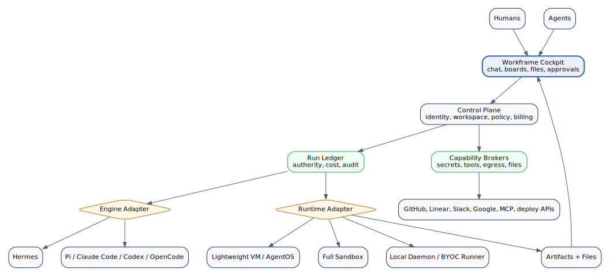

# Target Architecture

The target architecture separates cockpit, control plane, runtime adapters, engine adapters, brokers, and deployment cells.



## Workframe-owned stable layers

| Layer | Responsibility |
|---|---|
| Identity | users, organizations, workspaces, roles, SSO/domain allowlist |
| Social cockpit | rooms, DMs, live turns, approvals, notifications |
| Business state | boards, cards, goals, files, artifacts, decisions |
| Agent registry | persistent agents, roles, skills, memory, budgets |
| Run ledger | authority, status, cost, events, artifacts, audit |
| Policy engine | what actors can do under what conditions |
| Credential broker | BYOK, company keys, leases, rotation, revocation |
| Tool broker | GitHub, Slack, Linear, deploys, email, MCP, custom tools |
| Egress broker | network allowlists, proxying, exfiltration controls |
| Billing engine | credits, invoices, line items, marketplace settlement |
| Cell manager | local, Docker, VPS, provisioned, BYOC, enterprise deployments |

## Replaceable adapters

| Adapter type | Examples |
|---|---|
| Engine adapter | Hermes, Pi, Claude Code, Codex, OpenCode, AG2-style orchestrators |
| Runtime adapter | Hermes profile runtime, AgentOS lightweight VM, local daemon, full sandbox, microVM, Kubernetes job |
| Model adapter | OpenAI, Anthropic, OpenRouter, Google, DeepSeek, local model gateway |
| Tool adapter | GitHub, Linear, Slack, Google Workspace, Vercel, Netlify, MCP |
| Payment adapter | Stripe, credits, enterprise invoice, crypto/x402 future rails |

## Control flow

```text
human or agent creates intent
intent becomes card/message/trigger
Workframe creates run
policy engine grants capabilities
runtime adapter starts execution
engine adapter performs reasoning/tool loop
brokers mediate secrets/tools/files/network
run ledger records events and costs
artifacts return to files/boards/chat
approval gates promote sensitive outputs
billing settles line items
```

## Why adapter-first matters

Hermes is valuable today. AgentOS-style runtimes may become valuable tomorrow. Pi, Claude Code, Codex, OpenCode, AG2, and local daemon approaches may each win different niches.

Workframe should not choose one forever. Workframe should govern all of them.
