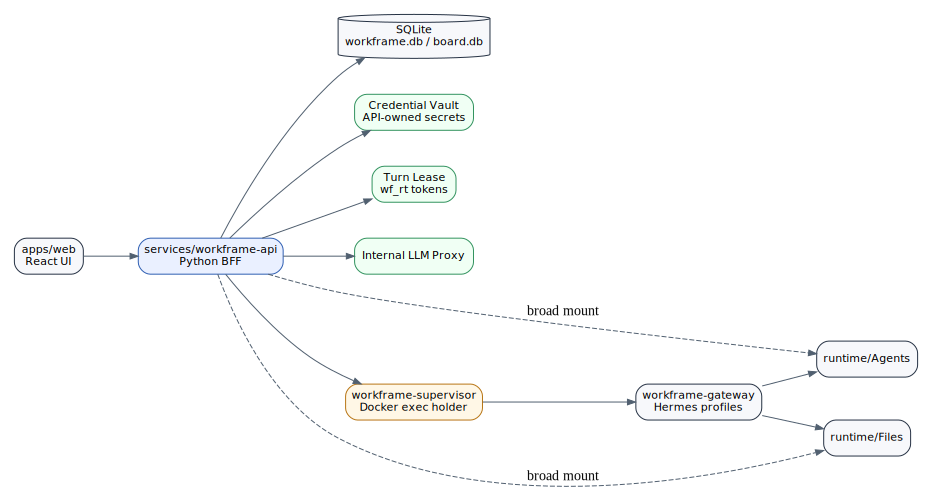

# Current State of the Codebase

## Repo anchor

| Field | Value |
|---|---|
| Repository | `npx-workframe/workframe` |
| Latest inspected commit | `eddc7f2fe7c2eb4a0fee24a150201428ea430c7a` |
| Commit message | `for comparison purposes` |
| Product version in this brief | `v0.1.1` |

## Active surfaces

The current repository identifies these active surfaces:

| Surface | Role |
|---|---|
| `apps/web` | Product UI, Vite/React |
| `services/workframe-api` | Python BFF, canonical backend |
| `packages/create-workframe` | npm installer |
| `packages/workframe` | lifecycle CLI |
| `infra/compose/workframe` | Docker gateway, dashboard, API, supervisor, UI |
| `scripts/workframe` | bootstrap, tunnels, install identity |
| `runtime/` | Agents, Files, API data, not in git |

## What is strong already

| Existing primitive | Why it matters |
|---|---|
| Workspaces and rooms | social substrate is real |
| Provider connect UX | user/company account model is emerging |
| Per-user runtime profiles | first step away from shared agent identity |
| Credential vault | secrets are moving out of Hermes runtime files |
| `wf_rt_` turn leases | correct capability pattern for model access |
| Internal LLM proxy | real upstream keys can stay server-side |
| Supervisor | Docker socket can be isolated from API path |
| Secure/dev unsafe split | correct deployment posture separation |
| Dashboard auth gate | Hermes dashboard exposure is being controlled |
| E2E/RBAC/security tests | security behavior is testable, not only documented |

## What remains prototype-shaped

| Area | Issue |
|---|---|
| Docker socket | API still has physical socket mount in current compose and should lose it |
| Broad volumes | API/gateway still see broad `runtime/Agents` and `runtime/Files` mounts |
| Per-turn env overlay | model secrets can still be written into profile `.env` paths in current flow |
| Profile authority | Hermes profiles carry too much execution authority |
| Space mentions | template profile model needs run-scoped payer/capability semantics |
| Filesystem access | no first-class run file manifest yet |
| Egress | no Workframe-owned default-deny egress broker yet |
| Run ledger | run is not yet the universal action/economic primitive |
| Billing | costs are not yet line-itemed by run and funding source |

## Current-system diagram

## Interpretation

The current codebase is not wrong. It is a practical cockpit around Hermes. The next stage is not a rewrite. The next stage is to pull authority upward into Workframe-owned runs, leases, capabilities, file manifests, brokers, and ledgers.
