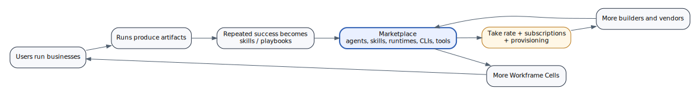

# Marketplace Expansion

The marketplace should emerge from the run/capability architecture, not precede it.



## What can be marketed

Almost everything in the Workframe ecosystem can eventually become a marketplace object:

| Object | Marketplace form |
|---|---|
| Agent | installable worker/persona with role, prompts, tools, memory seed |
| Skill | reusable task capability or `SKILL.md` style package |
| Playbook | multi-step workflow with triggers, cards, approvals, runs |
| Runtime | managed execution backend or adapter |
| CLI | packaged integration for Codex, Claude Code, Pi, OpenCode, Hermes |
| Tool | brokered capability with schema and pricing |
| Connector | Slack, GitHub, Linear, Google Workspace, MCP server |
| Template | Auto Game Dev Shop, SaaS Factory, Content Studio |
| Cell image | preconfigured deployment bundle |
| Model route | routing policy for cheap/frontier/private models |

## Marketplace governance

Marketplace packages should declare:

```text
publisher
version
permissions
required connectors
required secrets
network destinations
pricing model
risk tier
supported runtimes
audit events
uninstall behavior
```

## Marketplace monetization

Potential models:

```text
one-time install fee
monthly subscription
usage fee per run
usage fee per tool call
revenue share
enterprise-certified fee
verified publisher fee
runtime capacity fee
```

## Agent-to-agent economy

Long term, agents can pay other agents or tools for work:

```text
Research Agent pays Data API Tool
Design Agent pays Image Tool
Video Agent pays Render Runtime
Sales Agent pays Enrichment Connector
Build Agent pays Sandbox Runtime
```

The initiator ultimately funds the chain. The run ledger keeps the chain accountable.

This is where x402, crypto micropayments, stablecoin rails, and payment-gated APIs may become useful. They are not the core Workframe MVP, but the architecture should not block them.
