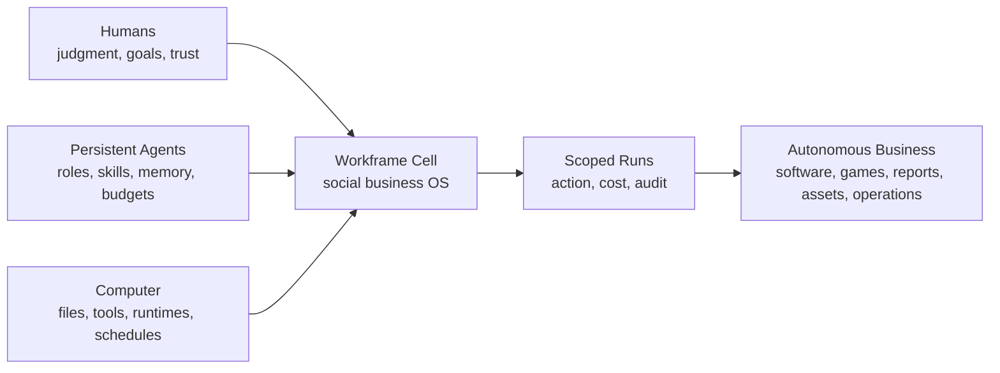
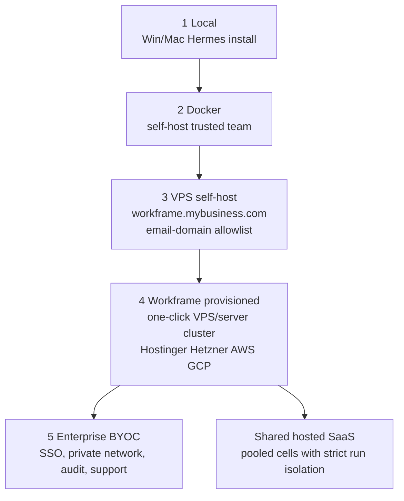
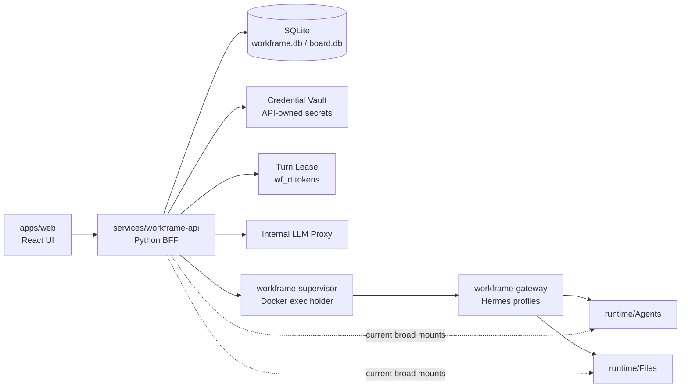
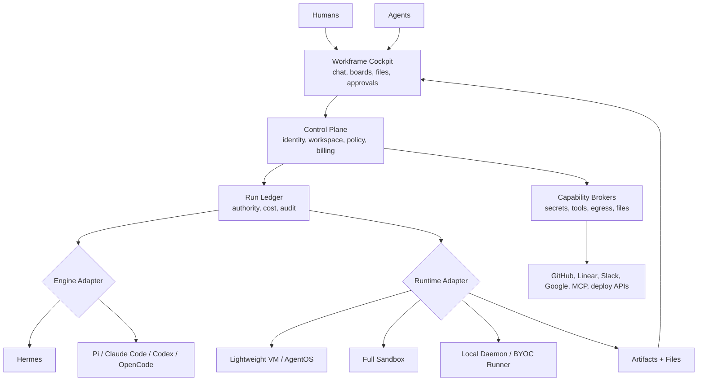
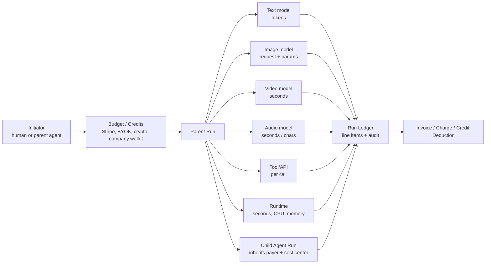
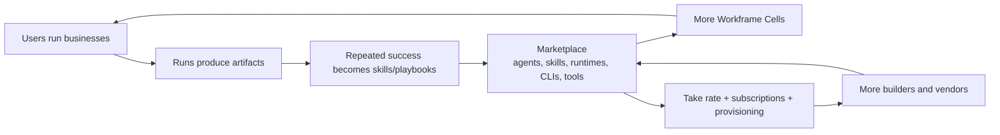

# Appendix: Mermaid Diagram Sources

## 01-first-principles

```mermaid
flowchart LR
  H[Humans
judgment, goals, trust] --> C[Workframe Cell
social business OS]
  A[Persistent Agents
roles, skills, memory, budgets] --> C
  M[Computer
files, tools, runtimes, schedules] --> C
  C --> R[Scoped Runs
action, cost, audit]
  R --> B[Autonomous Business
software, games, reports, assets, operations]
```

## 02-deployment-modes

```mermaid
flowchart TD
  L[1 Local
Win/Mac Hermes install] --> D[2 Docker
self-host trusted team]
  D --> V[3 VPS self-host
workframe.mybusiness.com
email-domain allowlist]
  V --> P[4 Workframe provisioned
one-click VPS/server cluster
Hostinger Hetzner AWS GCP]
  P --> E[5 Enterprise BYOC
SSO, private network, audit, support]
  P --> S[Shared hosted SaaS
pooled cells with strict run isolation]
```

## 03-current-system

```mermaid
flowchart LR
  UI[apps/web
React UI] --> API[services/workframe-api
Python BFF]
  API --> DB[(SQLite
workframe.db / board.db)]
  API --> Vault[Credential Vault
API-owned secrets]
  API --> Lease[Turn Lease
wf_rt tokens]
  API --> Proxy[Internal LLM Proxy]
  API --> Supervisor[workframe-supervisor
Docker exec holder]
  Supervisor --> Gateway[workframe-gateway
Hermes profiles]
  Gateway --> Agents[runtime/Agents]
  Gateway --> Files[runtime/Files]
  API -. current broad mounts .-> Agents
  API -. current broad mounts .-> Files
```

## 04-target-system

```mermaid
flowchart TD
  U[Humans] --> Cockpit[Workframe Cockpit
chat, boards, files, approvals]
  AG[Agents] --> Cockpit
  Cockpit --> CP[Control Plane
identity, workspace, policy, billing]
  CP --> Runs[Run Ledger
authority, cost, audit]
  CP --> Brokers[Capability Brokers
secrets, tools, egress, files]
  Runs --> Engine{Engine Adapter}
  Runs --> Runtime{Runtime Adapter}
  Engine --> Hermes[Hermes]
  Engine --> Pi[Pi / Claude Code / Codex / OpenCode]
  Runtime --> AgentOS[Lightweight VM / AgentOS]
  Runtime --> Sandbox[Full Sandbox]
  Runtime --> BYOC[Local Daemon / BYOC Runner]
  Brokers --> External[GitHub, Linear, Slack, Google, MCP, deploy APIs]
  Runtime --> Artifacts[Artifacts + Files]
  Artifacts --> Cockpit
```

## 05-run-billing-chain

```mermaid
flowchart LR
  I[Initiator
human or parent agent] --> Budget[Budget / Credits
Stripe, BYOK, crypto, company wallet]
  Budget --> Run[Parent Run]
  Run --> Text[Text model
tokens]
  Run --> Img[Image model
request + params]
  Run --> Vid[Video model
seconds]
  Run --> Audio[Audio model
seconds / chars]
  Run --> Tool[Tool/API
per call]
  Run --> Sandbox[Runtime
seconds, CPU, memory]
  Run --> Child[Child Agent Run
inherits payer + cost center]
  Text --> Ledger[Run Ledger
line items + audit]
  Img --> Ledger
  Vid --> Ledger
  Audio --> Ledger
  Tool --> Ledger
  Sandbox --> Ledger
  Child --> Ledger
  Ledger --> Invoice[Invoice / Charge / Credit Deduction]
```

## 06-marketplace-flywheel

```mermaid
flowchart LR
  Users[Users run businesses] --> Runs[Runs produce artifacts]
  Runs --> Skills[Repeated success becomes skills/playbooks]
  Skills --> Market[Marketplace
agents, skills, runtimes, CLIs, tools]
  Market --> Cells[More Workframe Cells]
  Cells --> Users
  Market --> Revenue[Take rate + subscriptions + provisioning]
  Revenue --> Builders[More builders and vendors]
  Builders --> Market
```
