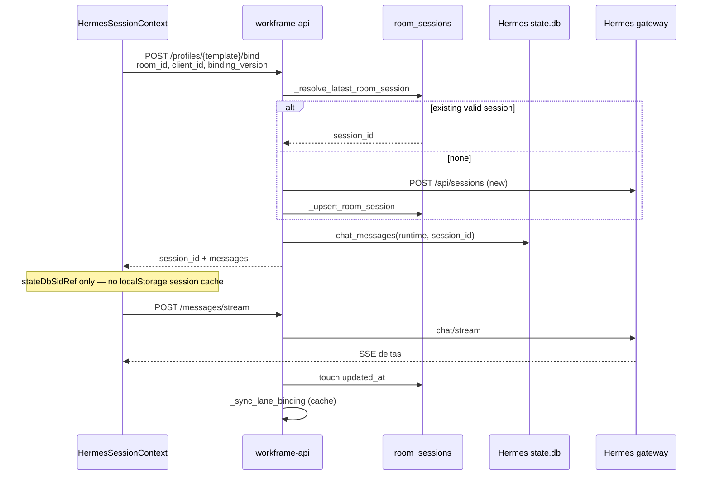
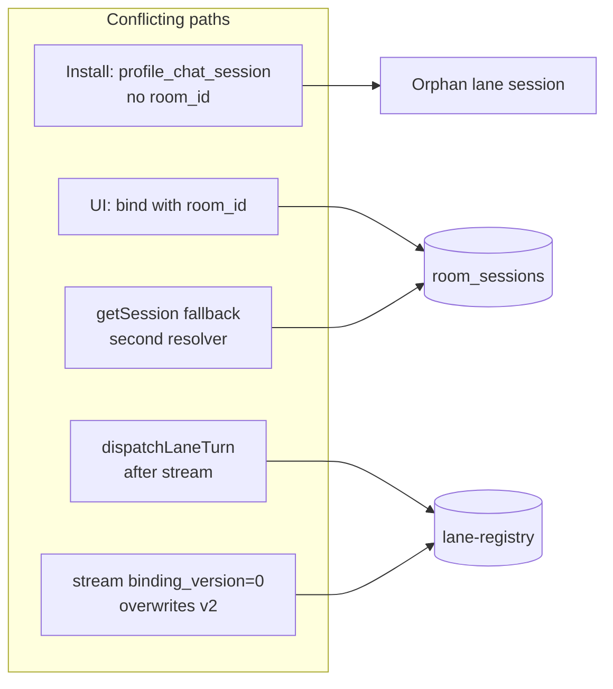
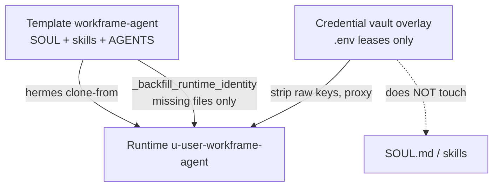

# Workframe session architecture

> **Canonical doc** (2026-06-23). Supersedes the lane-registry-as-SSOT sections in `SESSION_FLOW.md`.

## Sources of truth

| Layer | Store | Owns |
|-------|--------|------|
| **Room binding** | `workframe.db` → `room_sessions` | Which Hermes `session_id` is active for `(room_id, agent_profile_id)` |
| **Message content** | Hermes `state.db` per profile | User/assistant/tool rows for a `session_id` |
| **Runtime profile** | `Agents/profiles/u-{user}-{template}/` | SOUL, skills, config, credentials overlay |
| **Lane registry** | `lane-registry.json` | **Derived cache** for `(profile, source_id:client_id)` → `session_id` when UI tab needs a hint |

**Rule:** When `room_id` is present, `room_sessions` wins. Lane registry is mirrored after bind/stream/activate — never authoritative over `room_sessions`.

## Agent DM flow (intended)

## What was wrong (dogfood Jun 2026)

## Runtime profile identity

Bootstrap parity:

- **create-workframe** — copies full seed (SOUL, skills) at install
- **dogfood** — `bootstrap-native-profile.ps1` copies from `packages/create-workframe/profiles/workframe-agent`
- **BFF** — `ensure_runtime_profile()` backfills missing identity on every touch

## UI operations map

| User action | API | Session resolver |
|-------------|-----|------------------|
| Open agent DM | `POST .../bind` | `room_sessions` |
| Send message | `POST .../messages/stream` | `stateDbSidRef` from bind |
| New session | `POST .../bind` + `new_session: true` | archives prior row, creates new |
| Resume from Activity | `POST /rooms/:id/sessions/activate` | `room_sessions` + lane cache sync |
| Reload page | `POST .../bind` (same room) | `_resolve_latest_room_session` |
| Space @mention | server `chat_dispatch` | `room_sessions` + template profile |
| Steer / stop | `POST /api/chat/steer` \| `stop` | active run on runtime profile |

## Binding dimensions

| Context | `source_id` | `client_id` | `binding_version` |
|---------|-------------|-------------|-------------------|
| Browser agent DM | `ui` | `ui-{tab}` (localStorage) | `2` for native template only |
| Space agent turn | `room` | `room_id` | omitted |
| Legacy (deprecated) | `ui` | `default` | — |

## Deprecated paths (do not extend)

- `GET /api/chat/resolve` — lane-registry read without `room_id`
- `POST .../sessions` from UI as second resolver (removed from `HermesSessionContext`)
- `dispatchLaneTurn` after stream (stream `finally` already syncs)
- Install `profile_chat_session` without `room_id`

See `CHANGES-2026-06-23-session-vault.md` for the change log.
